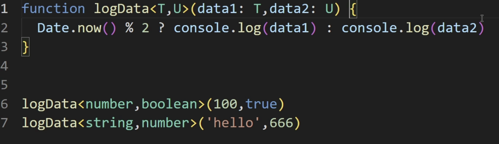
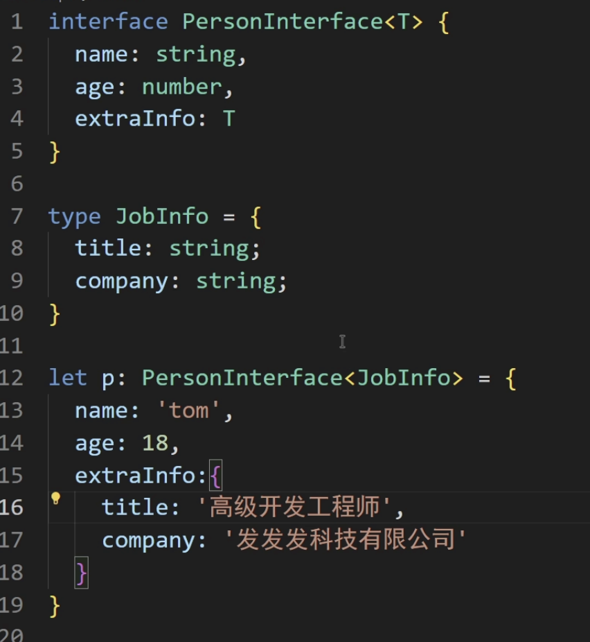

TS
<!--more-->
## 类相关

### override

子类 要重写父类方法的话 加一个 **override**

这个好处在于假设拼错了单词 typescript会发现并且报错

### 属性修饰符

#### public

可以被 类内部 子类 类外部访问

属性默认是pubilc 

这种情况就是在类的内部可以访问属性

这种代表可以在子类被访问

这样代表 类的外部可以访问这些public属性

### 属性的简写形式

### protected修饰符

类的内部，子类可以访问，外部不可以访问

### private修饰符

只能在类的内部使用

### readonly修饰符

只读属性，不可以修改

### 抽象类

抽象类 不能**实例化**其意义是**可以被继承**，抽象类里面可以有**普通方法**，也可以有**抽象方法**

啥时候使用抽象类？

- 定义通用接口： 为一组相关的类定义通用的行为时
- 提供基础实现：在抽象类中提供某些方法或为其提供基础实现，这样派生类就可以继承这些实现
- 确保关键实现： 如果子类继承抽象类后没有实现抽象方法，则会报错

## interface（接口）

### 定义类的结构

表示这个类实现了这个接口（按照接口的规范来）

implements！！！

### 定义对象的结构

把接口当成一种类型了，直接 user**：**UserInterface

### 定义函数的结构

### 接口之间是可以继承的

  

### 接口的自动合并

也叫可以重复定义接口

### 何时使用接口？

- 定义对象的格式 无脑冲
- 类的契约：规定类需要哪些属性和方法
- 自动合并：扩展第三方库的类型，在一些超大型项目中使用

## 一些相似概念的区别

### interface和type的区别

- 相同点： interface和type都可以用于**定义对象结构**，两者在许多场景中都是可以互换的
- 不同点：
  - interface更专注定义**对象**和**类**的结构，支持**继承、合并**
  - type可以定义**类型别名、联合类型、交叉类型、但不支持继承和自动合并**

这个就是type 定义 **类型别名** 的例子

Type支持**联合类型** 和 **交叉类型**

### interface和抽象类的区别

- 相同点： 都用于定义一个类的格式
- 不同点： 
  - 接口：只能描述结构，不能有任何的代码实现，一个类可以实现多个接口
  - 抽象类： 既可以包含抽象方法，也可以包含具体方法，一个类只能继承一个抽象类

这是一个类能实现多个接口的例子

## 泛型

泛型允许我们在定义函数，类或接口时，使用类型参数来表示未指定的类型，这些参数在具体使用时，才被指定具体的类型，泛型能让同一段代码适用于多种类型，同时仍然保持类型的安全性

也可以多个

### 泛型接口

### 类型声明文件

通常以.d.ts结尾

作用是为 **现有的js代码提供类型信息**

使得ts在使用这些老的js库或者模块时进行**类型检查和提示**